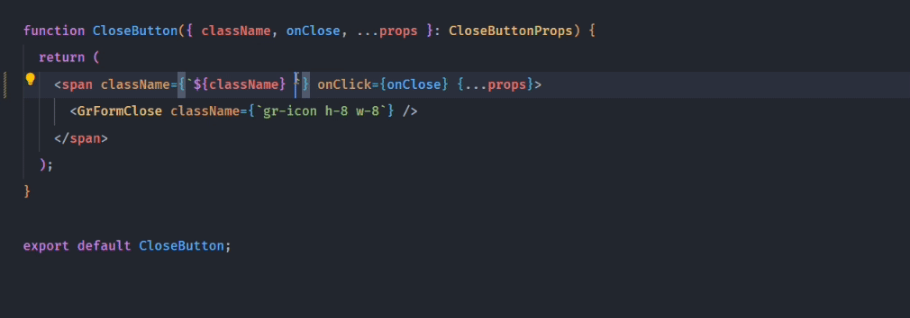
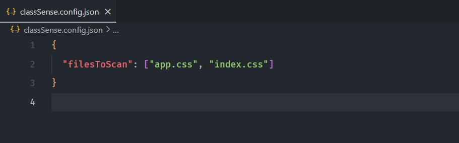

# ClassSense: CSS classnames autosuggestion

## Description

The **IntelliSense for CSS Class Names in HTML** extension for Visual Studio Code (VS Code) enhances your web development workflow by providing intelligent code completion for CSS class names within HTML files.

## Features

- Auto-suggest CSS class names from css files available in workspace.
- Cache Class Names for better performance
  - If css files is modified, you need to manually refresh cache.
  - Either use command: `ClassSense: Cache CSS files` or click on `ClassSense` on bottom right of statusbar.
- Command to manually re-cache the class definitions used in the autocompletion;
- Customizable User Settings to override which folders and files should be considered or excluded from the caching process.
- Support for config files to exclusively define which css folder to be processed

## Tested Languages Modes

- HTML
- Javascript
- Javascript React (.jsx)
- Typescript React (.tsx)

## Configuration

You can customize the extension's behavior by modifying the settings in your VS Code settings.json file. Available settings include:

### Configuration files

File must have a specific name: `classSense.config.json`. If you want to specify full path, main sure start pathname from root folder.

Either specify file by file name `app.css` or path `(e.g src/styles/app.css)`, it will works. 😅

### Extension Settings

- `classSense.excludeFolders`: Specify folder names to be excluded from suggestions.
- `classSense.filesToScan`: Specify files extension for should autosuggestions be provided
- `classSense.classAttributes`: Specify the attribute name where autosuggestion is provided
- `classSense.includeLanguages`: Specify lookup css files to extract class names

## Contributions

You can request new features and contribute to the extension development on its [repository on GitHub](https://github.com/PrabeenGautam/classSense-CSS-AutoCompletion/issues). Look for an issue you're interested in working on, comment on it to let me know you're working on it and submit your pull request! 🔥
